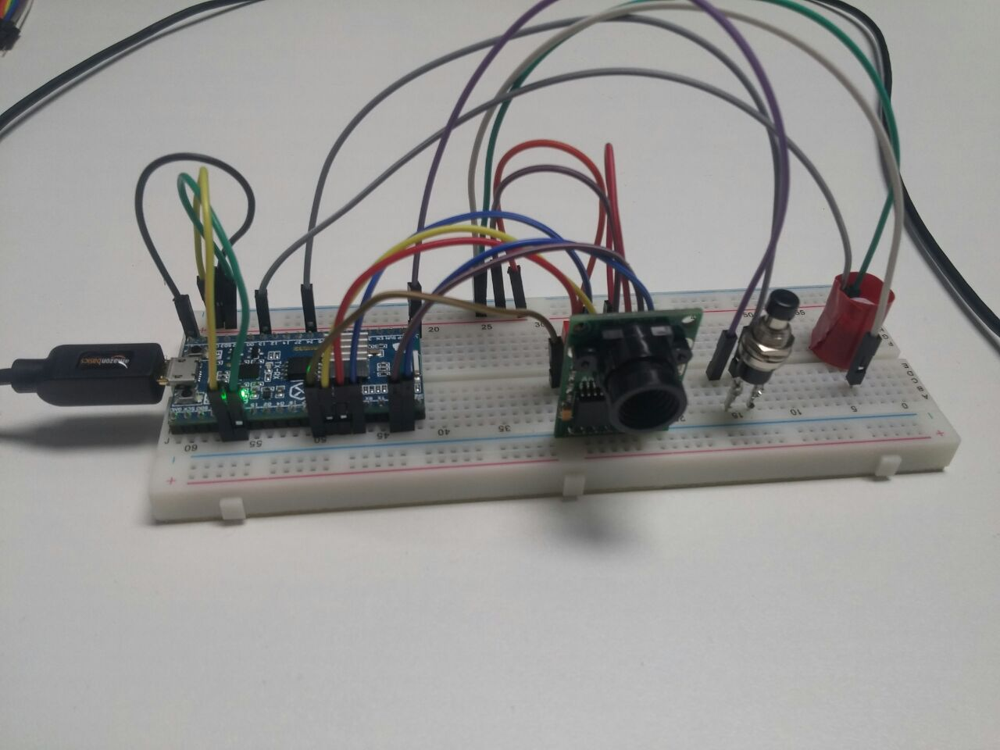
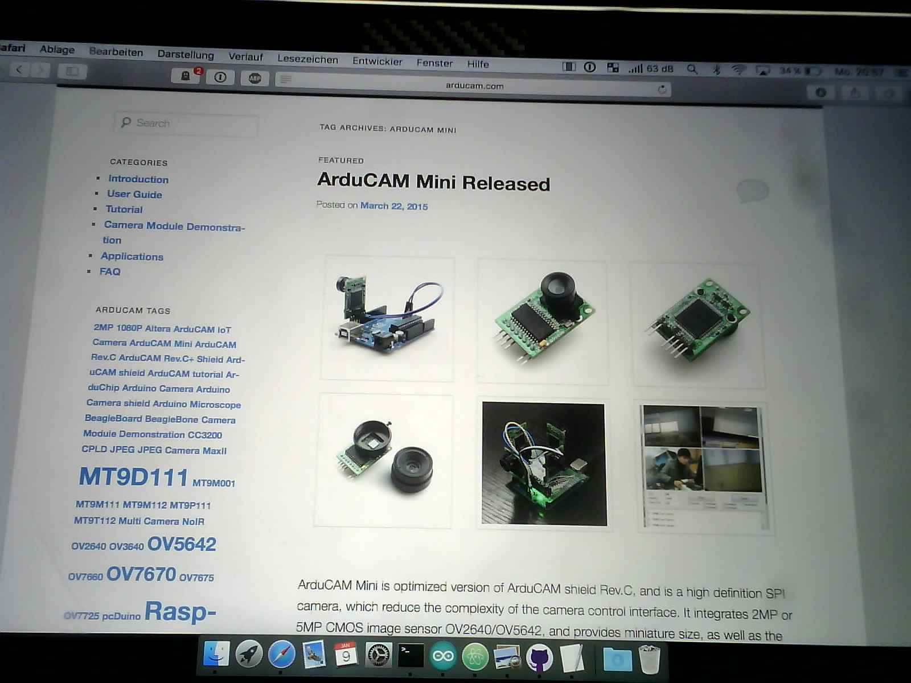

# ESP32 with Arducam Mini 2MP OV2640
This is an early port of the Arducam-Software for the ESP32 https://github.com/ArduCAM

Currently it only works with the Arducam Mini 2MP OV2640.

It is still not 100% stable.

1. Download the ESP32 Arduino library https://github.com/espressif/arduino-esp32
2. Copy the Arducam library into your Arduino library folder (ARDUCAM_ESP32_TCP.ino)
3. Open the Arduinosketch
4. Set your Wifi-Settings
5. Upload the sketch to the ESP32
6. Open a TCP Server on your PC
for i in {1..1000}; do sudo nc -l 80 | xxd -p -r > ${i}.jpg; done
7. (Re)-Start the ESP32

| A       | ESP32         |
| ------------- |:-------------:|
| VCC | 5V |
| GND | GND |
| SCL | GPIO 22|
| SDA | GPIO 21|
| CS | GPIO 05|
| SCK | GPIO 18|
| MOSI | GPIO 23|
| MISO | GPIO 19|

Test image. I have to clean my sensor somehow....

